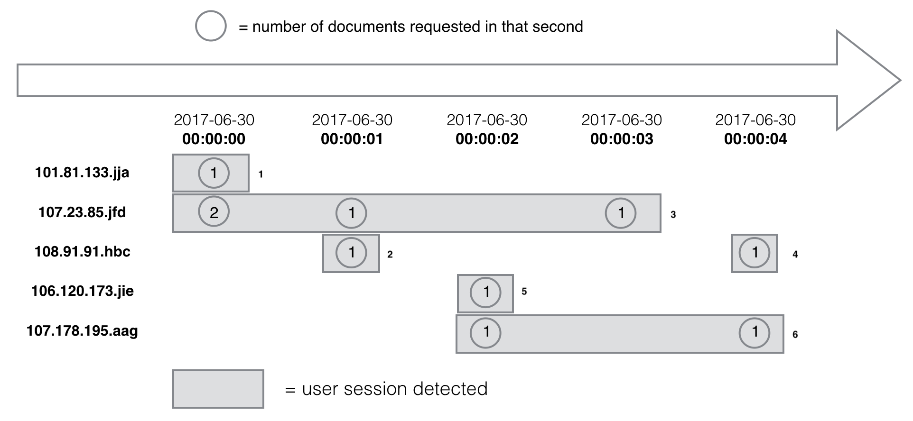

# EDGAR stream analytics
A coding challenge

## Requirements
Python 3.6.5

## Problem statement
### Problem description
[More on the coding challenge page](https://github.com/InsightDataScience/edgar-analytics)

Write a program to read in time-ordered weblog file and count requests made in each session.

### Input format
`log.csv`: time-ordered line-separated lists containing comma-delimited `ip`(string), `date` and `time`
>**ip,date,time**,zone,cik,accession,extention,code,size,idx,norefer,noagent,find,crawler,browser
`inactivity_period.txt`: single integer range from 1 to 86,400.

### Output format
`sessionization.txt`: line-separated lists containing comma-delimited `ip`, first date&time in session, last date&time in session, duration, count of requests.

## Approach
1. Prepare
   - list of set to store ip in its current active session log `active_log=[past_active_log(ip)]`
   - dict of active ip and information `ip_dict{ip:session_start_date, session_start_time, session_start_second, session_last_active_date, session_last_active_time, session_last_active_second, event_count, first_event_index}`

2. For each line, read in `ip`, `date` and `time`, update ip information in `ip_dict`, add ip in current session log (use `temp`), remove ip in last active session if possible.

3. Session log store in a reusable manner. Output all ip information in session log exceed the `act_period` in the order of `first_event_index`, assign current session log to it. Remove all ip in `ip_dict`.

## Comment
1. The time complexity is O(nlogn).
